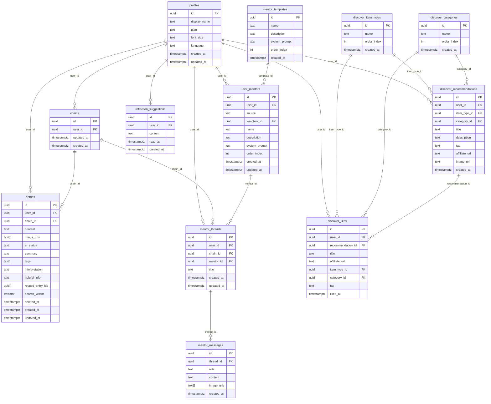

# editlife データモデル (DATA_MODEL.md)

> 根拠: `docs/SPEC.md`  
> 実装: Supabase (PostgreSQL 15)  
> 本ファイルが正典。`supabase/migrations/0001_init.sql` で具体化される。

---

## 1. ER 図



---

## 2. テーブル定義

### 2.1 profiles

`auth.users` を拡張するユーザープロフィール。Supabase Auth のトリガーで自動作成。

| カラム | 型 | 制約 | 説明 |
|-------|-----|------|------|
| `id` | uuid | PK, FK → auth.users.id | auth.users と同じ UUID |
| `display_name` | text | NOT NULL | 表示名 |
| `plan` | text | NOT NULL, DEFAULT `'free'`, CHECK IN `('free','pro')` | サブスクリプションプラン |
| `font_size` | text | NOT NULL, DEFAULT `'normal'`, CHECK IN `('small','normal','large')` | 表示設定 |
| `language` | text | NOT NULL, DEFAULT `'ja'`, CHECK IN `('ja','en')` | 表示言語 |
| `created_at` | timestamptz | NOT NULL, DEFAULT now() | |
| `updated_at` | timestamptz | NOT NULL, DEFAULT now() | |

---

### 2.2 chains

Entry と Thread をまとめる時系列グループ。AI 判定ではなく明示的ユーザー操作でのみ形成される。

| カラム | 型 | 制約 | 説明 |
|-------|-----|------|------|
| `id` | uuid | PK, DEFAULT gen_random_uuid() | |
| `user_id` | uuid | NOT NULL, FK → auth.users.id | |
| `updated_at` | timestamptz | NOT NULL, DEFAULT now() | 最新アイテム追加時にアプリが更新。feed のソートキー |
| `created_at` | timestamptz | NOT NULL, DEFAULT now() | |

> `updated_at` は DB トリガーではなくアプリ側で更新する。Entry/Thread の INSERT 後に `chains.updated_at = now()` を発行。

---

### 2.3 entries

ユーザーのジャーナルエントリ。AI処理結果を同テーブルに持つ。

| カラム | 型 | 制約 | 説明 |
|-------|-----|------|------|
| `id` | uuid | PK, DEFAULT gen_random_uuid() | |
| `user_id` | uuid | NOT NULL, FK → auth.users.id | |
| `chain_id` | uuid | NOT NULL, FK → chains.id | |
| `content` | text | NOT NULL | 本文 + 深掘りメモを連結して保存 |
| `image_urls` | text[] | DEFAULT `'{}'` | Supabase Storage の公開 URL |
| `ai_status` | text | NOT NULL, DEFAULT `'pending'`, CHECK IN `('pending','processing','done','error')` | AI処理ステータス |
| `summary` | text | | AI生成: 1〜2文の要約 |
| `tags` | text[] | DEFAULT `'{}'` | AI生成: ライフスタイルタグ 1〜3件 |
| `interpretation` | text | | AI生成: 解釈テキスト 2〜4文 |
| `helpful_info` | text | | AI生成: 気の利く情報 2〜4文 |
| `related_entry_ids` | uuid[] | DEFAULT `'{}'` | AI生成: 関連エントリID 最大2件 |
| `search_vector` | tsvector | | FTS用。AI処理完了時にアプリが更新 |
| `deleted_at` | timestamptz | | ソフトデリート。NULL = 有効 |
| `created_at` | timestamptz | NOT NULL, DEFAULT now() | |
| `updated_at` | timestamptz | NOT NULL, DEFAULT now() | |

---

### 2.4 mentor_templates

管理者が管理する「人気のメンター」プリセット。

| カラム | 型 | 制約 | 説明 |
|-------|-----|------|------|
| `id` | uuid | PK, DEFAULT gen_random_uuid() | |
| `name` | text | NOT NULL | メンター名 |
| `description` | text | NOT NULL | 説明文 |
| `system_prompt` | text | NOT NULL | システムプロンプト |
| `order_index` | int | NOT NULL, DEFAULT 0 | 表示順 |
| `created_at` | timestamptz | NOT NULL, DEFAULT now() | |

---

### 2.5 user_mentors

ユーザーが登録したメンター。3種の source を持つ。

| カラム | 型 | 制約 | 説明 |
|-------|-----|------|------|
| `id` | uuid | PK, DEFAULT gen_random_uuid() | |
| `user_id` | uuid | NOT NULL, FK → auth.users.id | |
| `source` | text | NOT NULL, CHECK IN `('custom','ai_suggested','template')` | 登録方法 |
| `template_id` | uuid | FK → mentor_templates.id | source = 'template' のときのみ |
| `name` | text | NOT NULL | |
| `description` | text | | |
| `system_prompt` | text | NOT NULL | |
| `order_index` | int | NOT NULL, DEFAULT 0 | mentor_top での表示順 |
| `created_at` | timestamptz | NOT NULL, DEFAULT now() | |
| `updated_at` | timestamptz | NOT NULL, DEFAULT now() | |

---

### 2.6 mentor_threads

Mentor との会話スレッド。Chain に属する。

| カラム | 型 | 制約 | 説明 |
|-------|-----|------|------|
| `id` | uuid | PK, DEFAULT gen_random_uuid() | |
| `user_id` | uuid | NOT NULL, FK → auth.users.id | |
| `chain_id` | uuid | NOT NULL, FK → chains.id | |
| `mentor_id` | uuid | NOT NULL, FK → user_mentors.id | |
| `title` | text | | スレッドタイトル（任意）|
| `created_at` | timestamptz | NOT NULL, DEFAULT now() | |
| `updated_at` | timestamptz | NOT NULL, DEFAULT now() | 最終メッセージ時刻 |

---

### 2.7 mentor_messages

Thread 内の各メッセージ。

| カラム | 型 | 制約 | 説明 |
|-------|-----|------|------|
| `id` | uuid | PK, DEFAULT gen_random_uuid() | |
| `thread_id` | uuid | NOT NULL, FK → mentor_threads.id | |
| `role` | text | NOT NULL, CHECK IN `('user','assistant')` | |
| `content` | text | NOT NULL | |
| `image_urls` | text[] | DEFAULT `'{}'` | 添付画像（userメッセージのみ）|
| `created_at` | timestamptz | NOT NULL, DEFAULT now() | |

---

### 2.8 reflection_suggestions

フィード上部に表示する振り返り提案。バッチ生成。

| カラム | 型 | 制約 | 説明 |
|-------|-----|------|------|
| `id` | uuid | PK, DEFAULT gen_random_uuid() | |
| `user_id` | uuid | NOT NULL, FK → auth.users.id | |
| `content` | text | NOT NULL | 提案テキスト |
| `read_at` | timestamptz | | クリック時刻。NULL = 未読 |
| `created_at` | timestamptz | NOT NULL, DEFAULT now() | |

---

### 2.9 discover_item_types

Discover のタイプ軸（商品 / 場所 / 体験）。管理者管理。

| カラム | 型 | 制約 | 説明 |
|-------|-----|------|------|
| `id` | uuid | PK, DEFAULT gen_random_uuid() | |
| `name` | text | NOT NULL, UNIQUE | |
| `order_index` | int | NOT NULL, DEFAULT 0 | |
| `created_at` | timestamptz | NOT NULL, DEFAULT now() | |

---

### 2.10 discover_categories

Discover のカテゴリ軸（美術 / 音楽 / 海外旅行）。管理者管理。

| カラム | 型 | 制約 | 説明 |
|-------|-----|------|------|
| `id` | uuid | PK, DEFAULT gen_random_uuid() | |
| `name` | text | NOT NULL, UNIQUE | |
| `order_index` | int | NOT NULL, DEFAULT 0 | |
| `created_at` | timestamptz | NOT NULL, DEFAULT now() | |

---

### 2.11 discover_recommendations

AI生成のレコメンドアイテム。バッチまたはオンデマンド生成。

| カラム | 型 | 制約 | 説明 |
|-------|-----|------|------|
| `id` | uuid | PK, DEFAULT gen_random_uuid() | |
| `user_id` | uuid | NOT NULL, FK → auth.users.id | |
| `item_type_id` | uuid | FK → discover_item_types.id | 絞り込み条件（nullable）|
| `category_id` | uuid | FK → discover_categories.id | 絞り込み条件（nullable）|
| `title` | text | NOT NULL | |
| `description` | text | NOT NULL | 推薦理由 |
| `tag` | text | NOT NULL, CHECK IN `('just_for_you','expand')` | カードバッジ種別 |
| `affiliate_url` | text | | フェーズ1はダミーURL |
| `image_url` | text | | プレースホルダー可 |
| `created_at` | timestamptz | NOT NULL, DEFAULT now() | |

---

### 2.12 discover_likes

ユーザーが Like したアイテム。タイトル・URL を非正規化して保持。

| カラム | 型 | 制約 | 説明 |
|-------|-----|------|------|
| `id` | uuid | PK, DEFAULT gen_random_uuid() | |
| `user_id` | uuid | NOT NULL, FK → auth.users.id | |
| `recommendation_id` | uuid | FK → discover_recommendations.id | 元レコメンド（削除されても likes は残る）|
| `title` | text | NOT NULL | 非正規化 |
| `affiliate_url` | text | | 非正規化 |
| `item_type_id` | uuid | FK → discover_item_types.id | 非正規化（絞り込み用）|
| `category_id` | uuid | FK → discover_categories.id | 非正規化（絞り込み用）|
| `tag` | text | NOT NULL, CHECK IN `('just_for_you','expand')` | 非正規化 |
| `liked_at` | timestamptz | NOT NULL, DEFAULT now() | |

> `recommendation_id` は ON DELETE SET NULL で、元レコメンドが削除されても Like は残る。

---

## 3. RLS ポリシー

### 基本方針

- ユーザーデータ（`user_id` を持つテーブル）: `auth.uid() = user_id` で完全分離
- マスタデータ（`mentor_templates`, `discover_item_types`, `discover_categories`）: 認証済みユーザーは SELECT のみ、書き込みはサービスロール
- `mentor_messages`: `thread_id → mentor_threads.user_id` の EXISTS で間接チェック

### ポリシー一覧

```sql
-- profiles
CREATE POLICY "own profile" ON profiles
  USING (auth.uid() = id);

-- chains
CREATE POLICY "own chains" ON chains
  USING (auth.uid() = user_id);

-- entries
CREATE POLICY "own entries" ON entries
  USING (auth.uid() = user_id);

-- mentor_templates (読み取り専用)
CREATE POLICY "read templates" ON mentor_templates
  FOR SELECT USING (auth.role() = 'authenticated');

-- user_mentors
CREATE POLICY "own mentors" ON user_mentors
  USING (auth.uid() = user_id);

-- mentor_threads
CREATE POLICY "own threads" ON mentor_threads
  USING (auth.uid() = user_id);

-- mentor_messages (スレッド経由で所有者チェック)
CREATE POLICY "own messages" ON mentor_messages
  USING (
    EXISTS (
      SELECT 1 FROM mentor_threads t
      WHERE t.id = thread_id AND t.user_id = auth.uid()
    )
  );

-- reflection_suggestions
CREATE POLICY "own suggestions" ON reflection_suggestions
  USING (auth.uid() = user_id);

-- discover_item_types (読み取り専用)
CREATE POLICY "read item types" ON discover_item_types
  FOR SELECT USING (auth.role() = 'authenticated');

-- discover_categories (読み取り専用)
CREATE POLICY "read categories" ON discover_categories
  FOR SELECT USING (auth.role() = 'authenticated');

-- discover_recommendations
CREATE POLICY "own recommendations" ON discover_recommendations
  USING (auth.uid() = user_id);

-- discover_likes
CREATE POLICY "own likes" ON discover_likes
  USING (auth.uid() = user_id);
```

---

## 4. インデックス戦略

### feed 表示（ボトルネックになりやすい箇所）

```sql
-- Chain 一覧: updated_at 降順でソート
CREATE INDEX ON chains (user_id, updated_at DESC);

-- Chain 内アイテム: chain_id で集める + created_at 昇順
CREATE INDEX ON entries (chain_id, created_at ASC)
  WHERE deleted_at IS NULL;
CREATE INDEX ON mentor_threads (chain_id, created_at ASC);
```

### エントリ処理

```sql
-- AI処理キュー: pending のエントリを速やかに取得
CREATE INDEX ON entries (user_id, ai_status)
  WHERE ai_status IN ('pending', 'processing');

-- ソフトデリート除外
CREATE INDEX ON entries (user_id, created_at DESC)
  WHERE deleted_at IS NULL;
```

### 全文検索 (FTS)

```sql
-- AI処理完了時に search_vector を更新する（アプリ側責任）
CREATE INDEX ON entries USING GIN (search_vector);
-- search_vector は "to_tsvector('japanese', content || ' ' || coalesce(summary,''))"
-- ※ japanese 辞書は pg_bigm 拡張または pgroonga が必要。
-- フェーズ1は simple 辞書で妥協し、後で差し替える。
```

### メンター機能

```sql
-- mentor_top: ユーザーのメンター一覧（order_index 順）
CREATE INDEX ON user_mentors (user_id, order_index);

-- チャット履歴
CREATE INDEX ON mentor_messages (thread_id, created_at ASC);

-- 同メンターの全スレッド
CREATE INDEX ON mentor_threads (mentor_id, created_at DESC);
```

### Discover

```sql
-- discover_detail: タイプ/カテゴリで絞って最新順
CREATE INDEX ON discover_recommendations (user_id, item_type_id, created_at DESC);
CREATE INDEX ON discover_recommendations (user_id, category_id, created_at DESC);

-- Likes 一覧
CREATE INDEX ON discover_likes (user_id, liked_at DESC);
-- Likes フィルタ
CREATE INDEX ON discover_likes (user_id, item_type_id);
CREATE INDEX ON discover_likes (user_id, category_id);
```

### マスタ

```sql
CREATE INDEX ON discover_item_types (order_index);
CREATE INDEX ON discover_categories (order_index);
```

---

## 5. 設計上の決定メモ

| 決定事項 | 理由 |
|---------|------|
| `entries.content` に本文+深掘りメモを連結 | SPEC §3.6。UI側で区切り文字（`\n\n---\n\n`）を入れてもよいが、APIレベルでは1フィールドで管理 |
| `chains.updated_at` をアプリ側更新 | Entry/Thread INSERT 後に同一トランザクションで更新。DB トリガーより透明性が高い |
| `discover_likes` に非正規化カラム | レコメンドが削除/再生成されても過去の Likes は残す必要があるため（SPEC §3.11）|
| `related_entry_ids` を uuid[] で持つ | max 2件・参照のみ。JOIN テーブルは過剰 |
| `search_vector` をアプリ更新 | japanese FTS の辞書選択が未確定。フェーズ1は `simple` + pg_trgm の LIKE フォールバックも検討 |
| `mentor_messages` に RLS 間接チェック | `user_id` を持たせると INSERT 時に thread オーナー検証が複雑になるため EXISTS で代替 |
